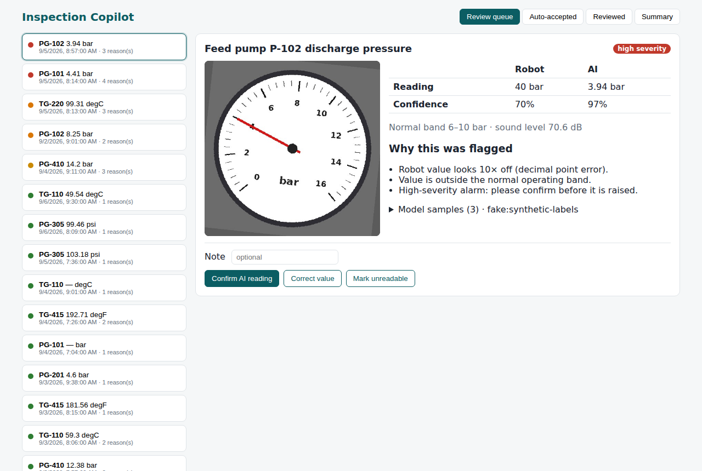
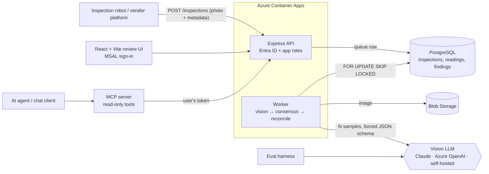

# Inspection Copilot

**AI-assisted reading and triage of robot inspection photos for industrial plants.**

Autonomous inspection robots patrol a site and photograph analogue gauges and equipment. Their on-board
readings are often wrong: wrong values, wrong units, decimal-point errors, or nothing at all. Inspection Copilot:

1. **Ingests** robot captures (photo + metadata) through an idempotent REST API.
2. **Reads each gauge with a vision LLM**, asked several times (*self-consistency*) and forced into a
   validated JSON schema.
3. **Reconciles** the AI reading with the robot's own reading, recognising known vendor fault patterns.
4. **Scores severity** against each asset's normal operating band and flags visible defects.
5. **Routes** anything uncertain or serious to a **human review queue**. Corrections are stored and become evaluation data.
6. **Exposes read-only tools over MCP**, so an AI agent can answer questions such as *"Which pumps are trending towards
   their limits?"*, with the same permissions as the user.
7. **Measures itself** with an evaluation harness against labelled images, including an eval gate in CI.

> All data in this repository is **synthetic** (generated by `tools/generate_dataset.py`). No real site, asset,
> vendor or company data is used.



## Architecture



| Layer | Tech | Where |
|---|---|---|
| Domain logic (pure, heavily tested) | TypeScript, zod | `packages/core` |
| Vision model adapters + structured output | Anthropic Messages API, OpenAI-compatible (Azure OpenAI, vLLM, Ollama), fake model | `packages/vision` |
| API + worker + Postgres queue | Express 5, node-postgres, SQL migrations, jose (Entra ID JWT) | `apps/api` |
| Agent tools | Model Context Protocol TypeScript SDK | `apps/mcp` |
| Review UI | React 19, Vite, TanStack Query, MSAL | `apps/web` |
| Evaluation | Labelled synthetic dataset, metrics, CI gate | `evals`, `tools` |
| Infra / CI | Bicep (Container Apps, ACR, Key Vault, PG Flexible Server, Blob), Azure Pipelines, Docker | `infra`, `azure-pipelines.yml` |

## Quick start (offline, no API key needed)

```bash
npm install
docker compose up -d db                     # Postgres 16
cp .env.example .env                        # VISION_PROVIDER=fake runs everything offline
export $(grep -v '^#' .env | xargs)

npm run dataset                             # regenerate the synthetic dataset (optional; committed already)
npm run db:migrate
npm run seed                                # pushes 48 robot captures through the real ingest API
npm run dev:worker                          # processes the queue (Ctrl+C when idle)
npm run dev:api                             # http://localhost:3000
npm run dev:web                             # http://localhost:5173
```

## Using a real vision model

```bash
# Claude
VISION_PROVIDER=anthropic ANTHROPIC_API_KEY=... ANTHROPIC_MODEL=<a current vision-capable model> npm run dev:worker

# Azure OpenAI
VISION_PROVIDER=openai-compatible OPENAI_BASE_URL=https://<res>.openai.azure.com/openai/deployments/<deployment> \
  OPENAI_API_KEY=... OPENAI_MODEL=<deployment> AZURE_OPENAI_API_VERSION=2024-10-21 npm run dev:worker

# Self-hosted open-weight vision model (data never leaves your network)
VISION_PROVIDER=openai-compatible OPENAI_BASE_URL=http://localhost:11434/v1 OPENAI_MODEL=<vision model> npm run dev:worker
```

## Evaluation

```bash
npm run eval                                 # fake model (plumbing check)
VISION_PROVIDER=anthropic npm run eval -- --samples 3
npm run eval -- --samples 1                  # does self-consistency earn its cost?
npm run eval -- --no-context                 # does the asset-register hint help or anchor the model?
npm run eval -- --gate                       # non-zero exit below thresholds (used in CI)
```

Metrics reported: accuracy within 3% of span, mean absolute error, unreadable-image refusal rate, false refusals,
auto-accept rate, **auto-accepted-but-wrong rate (the safety metric)**, robot-fault detection and false alarms,
defect precision and recall, tokens, estimated cost per image, and latency p50/p95. Results are broken down by image
condition (clean / noisy / occluded / unreadable).

Example from the offline fake model, which only checks the plumbing and says nothing about real model quality:

| | 1 sample | 3 samples |
|---|---|---|
| Accuracy within 3% of span | 90.9% | 93.2% |
| Auto-accepted but wrong | **3.6%** (fails the 2% gate) | **0.0%** |
| Robot false alarms | 14.3% | 7.1% |

Run the same comparison against a real model and record the results here.

## MCP tools (for agents)

`list_assets`, `list_findings`, `get_finding`, `get_inspection_image` (returns the photo so the agent can look for itself),
`analyse_asset_trend` (least-squares trend plus days until the normal band is breached), `inspection_summary`,
and a `daily_inspection_brief` prompt. The tools are **read-only by design**: approving a finding remains a human action.
See `apps/mcp/claude_desktop_config.example.json`.

## Tests

```bash
npm test          # 95 tests: unit (core, vision, evals), integration against real Postgres (api, via Supertest), MCP protocol, React components
npm run typecheck
```

Set `TEST_DATABASE_URL` if your test database isn't at `postgres://ic:ic@localhost:5432/ic_test`.

## Key design decisions

See [docs/DECISIONS.md](docs/DECISIONS.md).

## Roadmap

- Acoustic anomaly detection on pump audio (spectral features + baseline per asset) fused with visual findings
- Visual inspection beyond gauges: leaks, corrosion, valve positions
- Serve MCP over Streamable HTTP behind Entra ID with on-behalf-of token exchange
- Use reviewer corrections to tune prompts and thresholds, and to compare models
- Helm chart for running on k3s at sites without cloud connectivity
